# LABORATORIO4
# Redes y Máquinas Virtuales  

## Elaborado por:
**Rodian Garay**  
**Mariana Lombana**

---

### 1. Comunicación por consola  
Para iniciar el laboratorio, se estableció la conexión entre el computador y el **switch Cisco 2960** utilizando un **cable de consola**.  
Desde **Ubuntu**, se accedió al dispositivo empleando el siguiente comando:  

`screen /dev/ttyUSB0 9600`

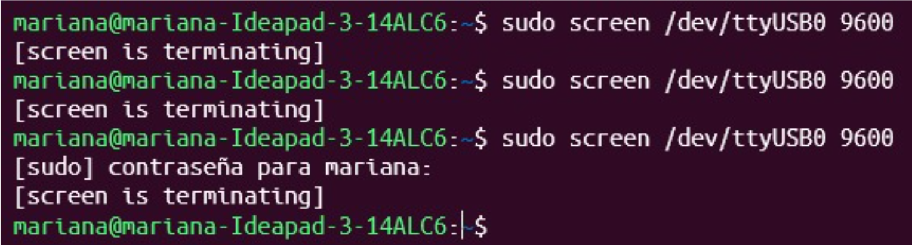

---
### 1.2. Configuración inicial del switch  
Dentro del modo de configuración, se realizó lo siguiente:  

- Asignación del **nombre de host**.  
- Establecimiento de **contraseñas de acceso**.  
- Activación de la interfaz principal.  
- Creación de la **VLAN 10** y asignación de su configuración correspondiente.  

Esto garantizó la segmentación y correcta comunicación entre los dispositivos conectados al switch.

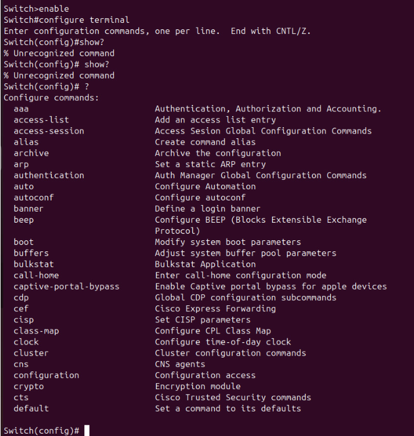

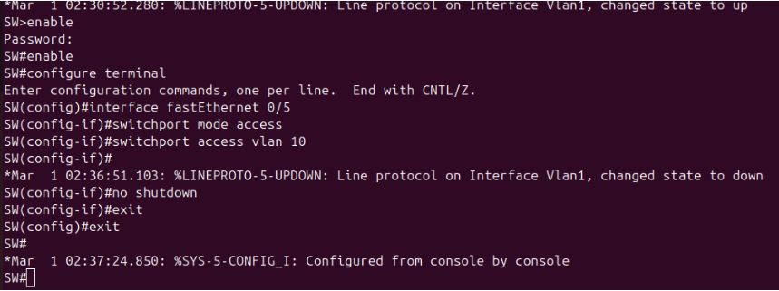

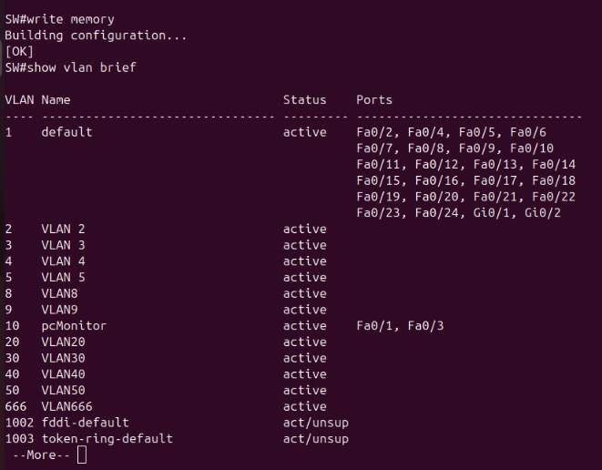

---  

#### 1.3. Configuración de la Raspberry Pi  
Se configuró la interfaz de red de la **Raspberry Pi** con una **dirección IP estática** dentro del rango asignado a la **VLAN 10**, garantizando su correcta comunicación con los demás equipos del laboratorio.  

**Configuración en consola:**  
`sudo nano /etc/dhcpcd.conf`

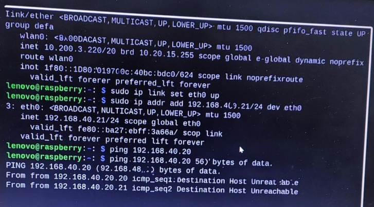

**Configuración del PC Monitor**
El PC monitor fue configurado con una IP dentro del mismo segmento de red, donde se comprobó la conexión con la Raspberry mediante el comando:`ping <ip_raspberry>`

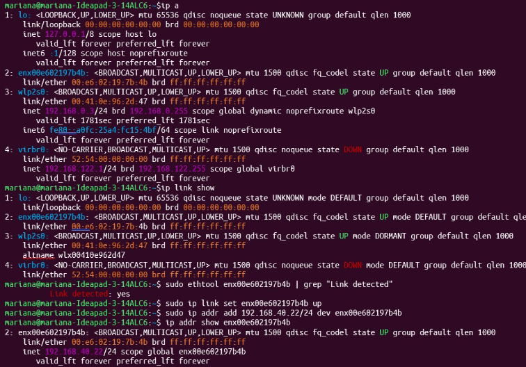
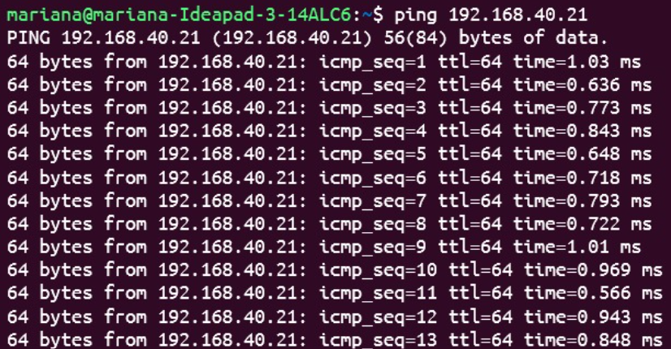

### 1.4 Comunicación con el PC del ETM
Se validó la conectividad entre la Raspberry Pi y el PC del ETM, ejecutando pruebas de ping en ambos sentidos, y esto confirmó la correcta integración de todos los dispositivos dentro de la red local.

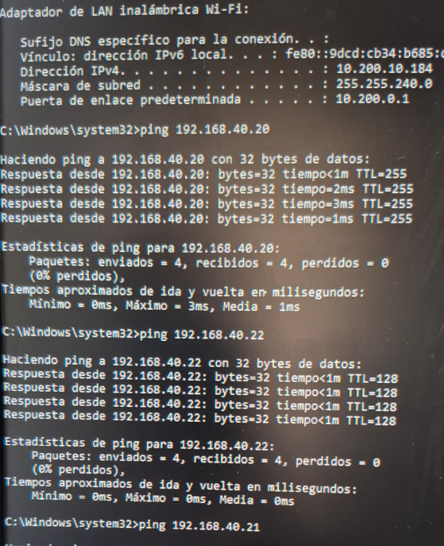

### 1.5 Exploración de red con Nmap
Se realizó un escaneo de red utilizando la herramienta Nmap, con el fin de identificar los dispositivos activos y los puertos abiertos:`nmap -sP 192.168.10.0/24`

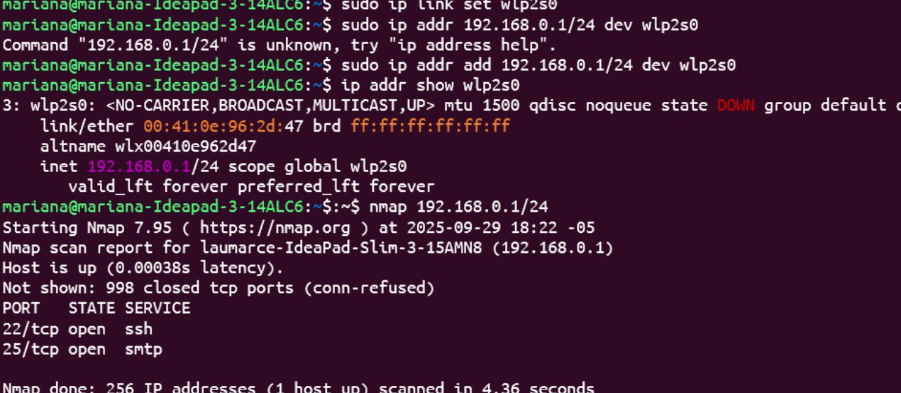

### 1.6 Transferencia de archivos

Se intentó transferir archivos entre los dispositivos usando diferentes puertos (como el 22 para SSH).

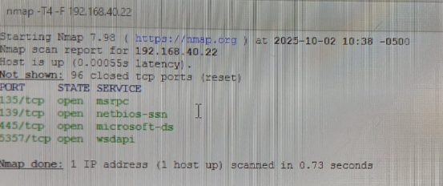

**Durante las pruebas se detectó que algunos puertos se encontraban bloqueados, lo que impidió completar ciertas transferencias.**

## 2. Instalación de la maquina virtual UBUNTU
## 2.1 Instalación de Ubuntu
Se configuró una máquina virtual con el sistema operativo Ubuntu.
Durante el proceso se documentaron todos los pasos: creación del disco virtual, instalación del SO y configuración de red.
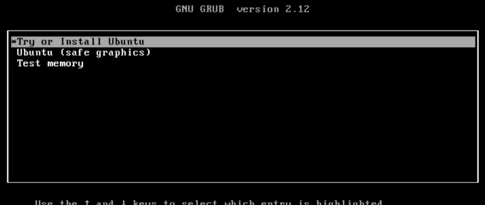

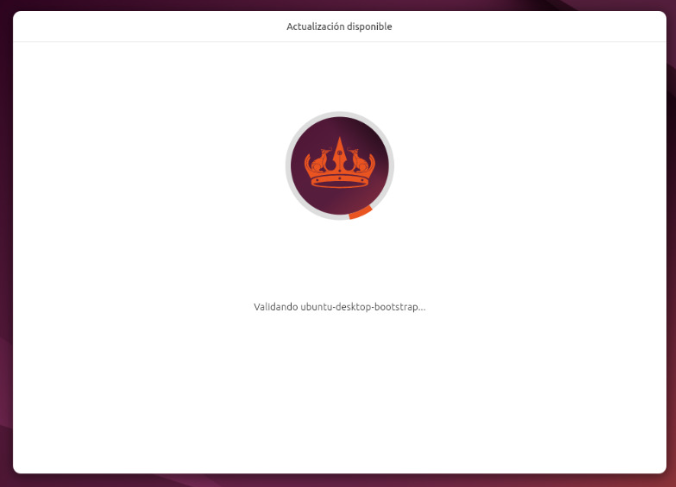
## 2.2 Instalación de CentOS
De manera similar, se instaló CentOS como una segunda máquina virtual, completando los pasos de instalación, creación del usuario y ajustes de conectividad

## 2.3 Instalación de Alpine
Para Alpine Linux, se utilizó QEMU, en el que los pasos principales fueron:`mkdir alpine_vm` `qemu-img create -f qcow2 alpine.qcow2 2G` `qemu-system-x86_64 -boot d -cdrom alpine.iso -m 512 -hda alpine.qcow2` , y tras la instalación, se configuró el usuario y la red para su correcto funcionamiento.

